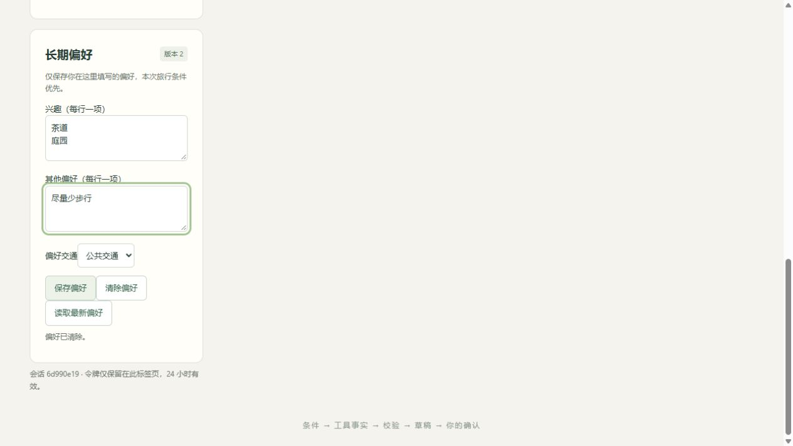
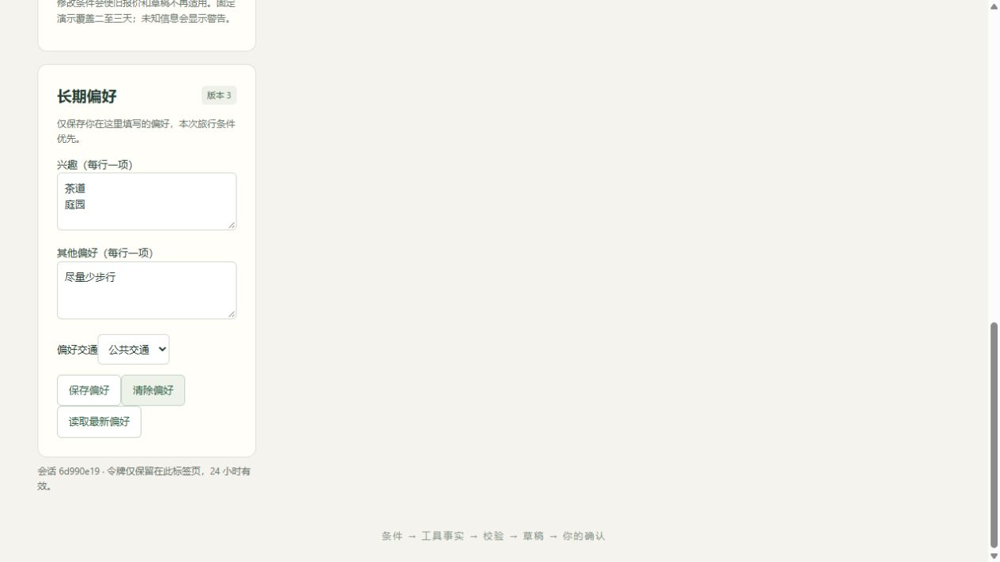

# M3 集中验证与学习记录

按[规格](../tasks/M3.md)实施。整体进度、命令与提交仅以[执行计划](../execution/travel-agent.md)为准；这不是要求用户逐项批准的关卡。

## 压缩后为什么仍能读取当前事实

运行时只观察SDK的compact_boundary系统事件。SDK管理压缩和消息配对，本项目不生成摘要、不改transcript。每个用户轮次读取PG权威快照；同版本使用SDK历史，条件/偏好版本变化则建立新会话。每轮工具执行器重新绑定run和限额，服务与数据库复用。

真实CLI与PG测试通过本地HTTP响应的人工usage和5%测试阈值触发原生自动压缩。检查每个出站请求仍含当前日期/版本/有效Evidence、无过期引用，工具结果全部有对应调用；保存后以默认阈值续接并实际校验营业时间。长持久对话只注入最近两轮、有界文本。快照读取失败时零模型请求，摘要接口503时不保存完成检查点。

极低测试阈值在续接大工具结果时触发CLI的Read工具子集请求，现有守卫安全拒绝；未扩大文件访问权限。正常续接恢复默认阈值，首轮压缩证据保留。人工usage、脚本响应和此边界实验只证明工程机制，不证明真实模型压缩质量或长期成功率。

## 偏好如何删除

偏好由用户在页面明确保存，模型没有写偏好工具。PATCH只更新提交字段；用户行锁和expected_revision裁决竞争。当前旅行条件始终优先，偏好不自动改TravelRequest。

首次DELETE即使原值为空也推进版本并保存墓碑，同一墓碑重复清空不再推进。偏好变化同时保存业务回顾边界：旧TaskRun仍可由用户读取，但不再作为新模型会话上下文。按执行创建时间过滤也排除了删除前开始、删除后才完成的旧轮次。SDK检查点核对偏好版本，变化后新建会话，不改写transcript。

独立审查发现并修复两个P2：初始空删除未使旧编辑失效；旧回答会将已删除标记带回新快照。真实PG和实际CLI回归包含已持久化的旧回答，验证新请求不含旧标记、旧SDK ID失效、历史仍可供用户读取、新对话继续回顾。攻略文字无法写入偏好。

浏览器发现原旅行条件栏吸顶遮挡偏好按钮，键盘可提交而鼠标无效；已移除吸顶。修复后实际鼠标保存、刷新恢复、清空和重复清空通过，旅行条件仍为原版本。

真实CLI用本地HTTP脚本响应，不产生模型费用；它证明上下文边界和工程链路，不证明真实模型偏好遵循率。M3其余能力与模型实验尚未全部验收。

## 外部MCP为什么没有另一套工具

`backend/mcp/server.py`只筛选四个既定查询工具，list复用同一schema，call复用TravelToolExecutor。官方MCP2.3 Server和StreamableHTTPSessionManager负责协议、会话机制与请求大小；本项目只补HTTP身份/会话归属。

端点绑定用户已创建的session_id，每个请求检查Bearer身份，stateless不共享模型会话。执行器本身绑定run，故每个调用建立执行器而非全服务复用一个受限执行器；业务服务和数据库连接池复用。查询产生Evidence元数据，不修改条件或下订单。

官方客户端legacy初始化与auto发现、工具列表及四工具调用均使用真实PG验证。另有真实TCP端到端正常查询→工具依赖失败，失败返回同一安全错误契约。鉴权/越权、空结果、非法/未知工具、目录ID不存在、DB不可用、Host/Origin和64KiB请求上限有回归。

SDK的端口通配匹配只检查前缀，本项目另外严格解析本机Origin，拒绝伪造端口后缀、userinfo、路径和外部主机。没有关闭SDK保护，也没有自写MCP协议。

## 固定流程与自主选择如何比较

两组都运行Claude Agent SDK，使用同一工具schema与PG业务执行器。固定组只增加阶段守门；参数和方案仍由模型生成，不注入grader期待。行程组按地点→酒店→路线→校验→草稿→展示，用户确认边界不变。每案例新评测身份/session，先持久化实际上下文关联再允许计费。

已有目录必须与版本化快照完整一致；漂移拒绝并保留原数据，不靠覆盖或删除保证“相同”。manifest记录实际目录/代码/工具/案例hash。缺usage、只采到部分HTTP、离线脚本token都记unknown。

真实DeepSeek hotel-complete-control两组各一次，输入、代码、schema、目录与Case哈希一致，均通过原规则。自主组5次HTTP、5次工具、14.316秒、0.091532 CNY；固定组6次HTTP、8次工具、14.646秒、0.111926 CNY。固定组额外刷新三份报价，本样本没有显示调用数改善；n=1不能归因或外推整体编排优劣。价格为保守价表估算，非账单。

脱敏[对照证据](../evidence/m34-hotel-comparison-2026-10-03.json)只保留身份版本、规则、计数/费用/时延/hash；原回答与Trace在私有缓存。原规则不因离线脚本只会搜索而降低：DB离线同酒店案例仍0/1、tool_selection失败。完整行程和冻结集统计尚未验收。

## 模型线路如何复用与隔离

SDK、旅行schema/执行器不变；配置显式选择供应商/model，私有工作进程只得到本机守卫令牌。父进程只向固定DeepSeek/Anthropic Messages地址转发，不使用任意代理、重定向或自动fallback。人民币/美元不换汇、不借用，原币种进入报告与Trace；历史CNY字段仅为旧记录兼容。

已有CNY账本32次/0.301908，读取前后字节/hash相同。USD累计授权0/0；设置密钥/DAILY_BUDGET_USD无法授予请求。真实CLI本地脚本完成DeepSeek与Haiku4.5旅行工具/续接，测试专用合成USD额度在测试退出后恢复，不修改实际授权。

核对[官方Haiku规格](https://platform.claude.com/docs/en/models/haiku-4-5/overview)和[价表](https://platform.claude.com/docs/en/about-claude/pricing)，仅锁定claude-haiku-4-5-20251001：200K上下文，普通输入/输出$1/$5每百万token；缓存未知TTL按更高1h写价2x保守结算，读缓存以普通输入上界。完整上下文最高写价先预占，usage缺失保留预占。未使用SDK美元估计或把保守估算当账单。

[Sonnet5.5](https://platform.claude.com/docs/en/models/sonnet-5-5/overview)有新的thinking协议，不能直接套用已锁定SDK配置；未核定模型明确拒绝。真实Anthropic服务/效果和跨模型统计未验，不能把本地脚本当真实模型证据。
