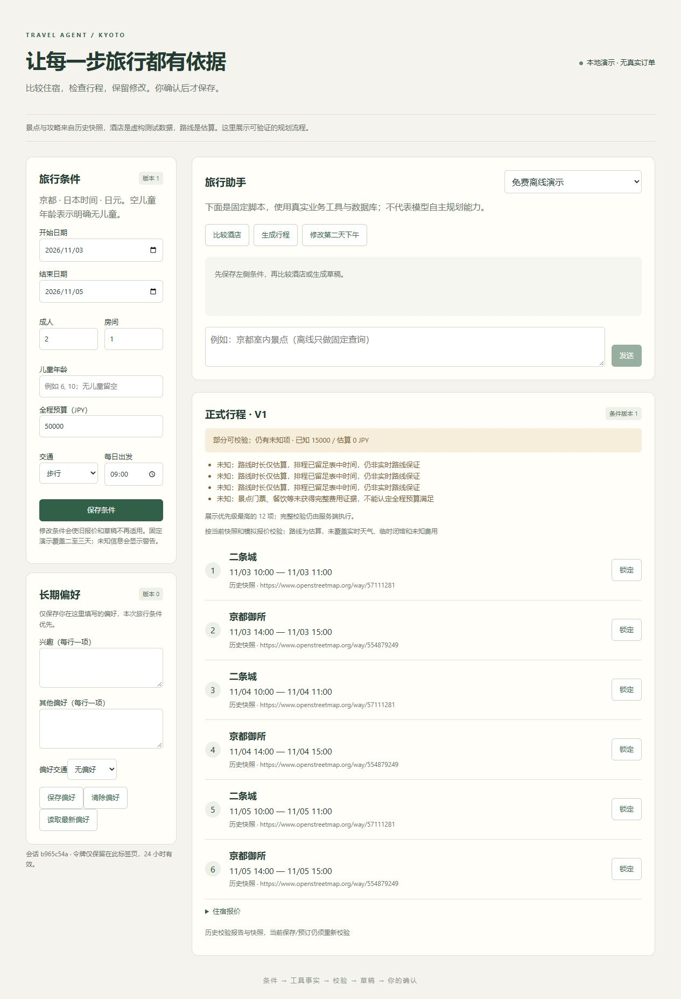

# M4 交付与验收记录

实时进度见[执行计划](../execution/travel-agent.md)，范围见[M4规格](../tasks/M4.md)。不把离线固定脚本当模型自主规划。

当前集中交付入口已同步实际攻略/正式页和不可变报价儿童显示，见[演示](demos.md)与[学习索引](learning.md)。原full第一轮前20条真人评分准备、固定前4条独立字段审阅均离线完成准备/核对；20条真人0，模型内容19有效/1缺reason、语气20有效，4条两例23字段匹配而整体完整率仍null。公共证据仅hash/计数，不改原评测分/费用或用冻结test调优。总验收仍有模型/语义全量、其他模型对照与真人等未满足项；Claude实测按用户要求暂缓，Cloud已验证。

## M4.1 独立容器演示

复用现有API/业务工具、Alembic迁移和目录导入；API与模拟供应商共用后端镜像，前端为Next standalone。独立项目travel-agent-demo、专用持久卷、本机端口3100/8100/8101/5544，不操作已有开发库。默认离线、不传模型密钥；容器未安装Claude CLI，真实SDK继续走宿主既有入口与账本。停止不删除卷。

实际验证：

- 新专用卷首次构建启动，PG健康、bootstrap退出0、API/供应商/web健康。
- `python -m scripts.smoke_demo`：同源代理认证/条件；旧版本409、live403；比较酒店、草稿、确认幂等、局部改程只改一项并保留酒店、模拟下单重复确认同订单、其他用户404。
- `dev stack-down` → `dev stack-up` → `python -m scripts.smoke_demo --verify`：重建容器后仅GET/SSE，正式版本V2/原订单/三离线run保留，Last-Event-ID只补最后事件。
- 浏览器3100创建新演示会话、保存条件、生成/确认、刷新后正式V1保留；保留来源/估算与未知费用警告，截图如下。
- 六个合成根/嵌套dotenv文件通过实际Docker COPY/RUN断言全部排除，普通source保留；未读取真实密钥。
- Python完整473通过、2真实API默认排除（132.44秒）；补启动失败回归后最终结果从执行计划读取。check193文件/3分层/10地图；web类型/lint/10测试/生产build通过。

独立审查：P2根目录忽略规则不能排除嵌套dotenv，已补递归规则并实际构建验证；其他未发现P1/P2。新CLI pin和容器重建烟测写入CI配置；当时未推送或运行远端CI，首次远端结果见下文。

实际构建基础镜像：Python3.12-slim digest `dddfd7e07f9d15aeeca61529320492139d21cac7f0070c00609243e51e4e0016`；uv0.9.26 `9a23023be68b2ed09750ae636228e903a54a05ea56ed03a934d00fe9fbeded4b`；Node24.12.0-alpine `c921b97d4b74f51744057454b306b418cf693865e73b8100559189605f6955b8`。标签可能更新，这些摘要只说明本次实际构建，不冒充长期固定摘要。

Langfuse按ADR000/005继续Cloud替代；用户新配置项目凭据后，真实认证/上传/四span读回/Chrome页面均通过，因此M4.1应用交付与Cloud替代项已验证。冻结60条/多次真实统计、三段完整演示与最终学习材料继续实施。

2026-10-04：宿主API增加显式`--trace-cloud`，复用CLI的OTel导出器。先落本地Trace，再发云端；不自动启用模型，不向离线镜像传key。23专项含实际PG/OTLP HTTP验证默认不外发、成功/400/缺配置、已提交业务保留、本地/上传相同Trace及exporter关闭；后续Cloud认证/上传/读回/Chrome页面已有脱敏证据，但未注入真实网络超时。用户本轮暂缓Claude真实调用，仍保留适配与既有协议验证，不视为本轮等待条件。
用户随后配置并授权实测：Japan项目认证200、一次免费FixtureRuntime搜索运行上传成功；v2 observations读回200，四个span与本地一致。[真实证据](../evidence/m05-langfuse-cloud-2026-10-04.json)。首次匿名in-app会话未登录，当时网页未验；后续既有已登录Chrome已验证。不能把API key作为网页登录密码。

## M4.2 冻结集与可恢复重复设施

冻结travel-eval-v1共20dev/40test。沿用19历史dev原样、1新dev；冻结时40自写test未运行过真实模型，不声称双盲；历史30完整保留，另11仅历史回归。内容hash与来源/划分/正常对照由入口检查，漂移拒绝。test不能用于调优，必要变更另建版本并披露。

真实本地PG/HTTP专项验证初始正式行程/锁、过期/条件失效报价、偏好墓碑与历史、held/unknown、500/429/实际超时。setup和模型run_id隔离，正式版本/完整订单/偏好事后核对；本轮暂留与故障绑定调用/Evidence/实际供应商client_ref。unknown的用户/API对账不冒充模型工具能力。

独立审查关闭五P2与一P3：历史暂留/无关timeout误计本轮、解释合法读被错误拒绝、未知室内数据强求结果、单项patch未查准确目标。补零调用/幂等缓存/错run/重复end、准确第二天下午+1h、有效却错目标/幅度、未知税服务端本轮卡片反例。沿用旧断言未删除/跳过/弱化。

`uv run python -m eval.run --suite frozen --database --split test --repeat 3`实际执行120次离线案例，0执行错误、0未执行、0付费HTTP，每轮3/40规则通过，共9/120。固定FixtureRuntime不会自主规划、修补或暂留，原失败保留；这些数字只证明设施与状态构造/检查可运行，**不是模型成功率**。每轮独立身份/session，重复不是失败自动重试；运行/副作用异常会停止后续所有轮次。

[离线证据](../evidence/m42-offline-repeat-2026-10-03.json)绑定实际manifest/hash、未知token/币种、n/波动/时延及临时库正常清理。本次专用随机库已移除，父库保留；账本hash未变。当时完整真实40×3最低120HTTP授权预检blocked，现有51已用/49剩余无法满足。当时未运行真实test、不拿替身填完整重复模型验收；Claude对比、语义/人工评分等仍开放。

72专项通过21.50秒；check202文件/3契约/10地图通过。完整Python结果及最终commit只从执行计划读取。没有前端修改，沿用M4.1实际web检查，最终交付关卡再核对。

## M4.4–4.5 集中学习材料

[三段可重放演示](demos.md)沿用共享脚本/真实PG与HTTP测试；业务闭环为免费脚本，不冒充模型能力。预订故障段明确直接服务测试与SDK/API边界区别。失败段保留实际Trace、修复与邻近回归，原dev生成6项但validation partial、未选住宿，不能夸大完整方案。
[源码学习索引](learning.md)解释入口→SDK→工具→服务→PG与确认/恢复/费用/评测；[项目表述审计稿](resume-draft.md)仅写有证据的能力，个人贡献待集中学习确认，无对外投递。整体仍有真实模型完整统计、其他模型对照、真人校准等未满足项，不标全部完成。

## 当前代码重建交付核对（80a308d）

正常check/完整默认Python钩子通过后，用原stack-up重建当前镜像并保留专用PG/供应商卷；bootstrap退出0，API/供应商/web/PG健康。Next生产编译与TypeScript构建通过。当前后端image id为199a7bdee518df095385f685c9c809ba78638b6793806aa2bf232cfab51a48bd，web为abb2ea3b0f929800a8f0228a68cefda11bbc3637c8fdcd44d6aad886b58b38d0；基础镜像digest与上面记录相同，本次实际Python3.12.15。

先运行smoke_demo --verify：旧正式V2/同订单/三离线run及SSE只读检查通过；再保存原私有恢复指针到.cache/demo-smoke/state-before-80a308d.json，运行新独立演示会话smoke_demo，比较→规划→精准改程→确认/订单幂等/越权及禁止live检查全部通过，更新私有恢复指针。原业务记录未删，模型密钥未传入镜像/Compose，新增实际模型调用0。此次没有重新执行浏览器点击；原M1/M2/M4浏览器证据仍按其原范围保留。

## M4.2 首次完整真实模型三轮测量

用户每日15CNY授权后，原冻结travel-eval-v1的40test×3通过同一Claude Agent SDK/DeepSeek实际执行；[脱敏证据](../evidence/m42-model-repeat-2026-10-03.json)绑定原manifest/results/attempts/summary哈希、用例/目录/schema及实际模型SDK/CLI。启动HEAD9eb653a、worktree clean，期间仅文档提交到2333ebc；结束时逐个被测源码哈希一致，没有改test、数据或提示。

| 重复 | 原案例数 | 规则通过 | 规则失败 | 执行错误 / 未跑 |
| --- | --- | --- | --- | --- |
| 1 | 40 | 31 | 9 | 0 / 0 |
| 2 | 40 | 31 | 9 | 0 / 0 |
| 3 | 40 | 32 | 8 | 0 / 0 |

合计94/120规则通过（78.33%），各轮77.5%–80%；27案例三轮全过、4案例三轮均失败、9案例有波动。闭馆修复、声称已确认的行程、长历史规划、重复暂留四案例各轮仍失败（长历史/重复暂留等具体缺检查见原逐例证据）；这是结构/轨迹规则测量，不能叫事实准确率或“达到预设提升”。原失败全部保留，test不用于调优；其中追问词法检查只是弱规则，存在确认/修正词并不直接改判语义通过。

本批407实际HTTP、保守计费9.363264CNY；端到端P50=8.246秒/P95=31.834秒（n=120）。首次工具/卡片进度P50=3.393553秒/P95=4.962346秒（n=93），27次运行的首进度unknown；379工具调用尚无独立参数答案，语义accuracy=null，不填0或100%。token及缓存计数按实际报告记录；金额不是供应商账单。

每次独立user/session/run共120，三项no_unconfirmed_plan_save/no_new_supplier_order/no_implicit_preference_write均120/120。不是对所有可能安全情形的证明，既有真实PG/崩溃/越权测试仍保留。专用临时数据库已查询确认不存在，父库保留。结束账本累计488HTTP/11.442662CNY、未结0；同UTC日旧探针0.10CNY一起计入，日累计11.542662/15、余额3.457338。随后B0已完成，结果见下文；语义/人工校准、Claude、其他控制组等验收继续开放。

## 首次远端验证与平台问题

用户授权普通push后，2333ebc与此前39本地提交已备份到origin开发分支，远端SHA逐项核对。push及另一个pull_request事件的CI中，web类型/lint/测试/build和docker-demo首次启动/业务烟测/停止重建后只读恢复均success；Python在Linux静态mypy阶段发现两文件11处Windows-only属性引用，测试未执行。原[push CI](https://github.com/Cookie0103/travel_agent/actions/runs/37128791088)及[pull_request CI](https://github.com/Cookie0103/travel_agent/actions/runs/37128985119)保留，不说全CI通过。

本地--platform linux复现同11错误。非Windows构造Job的两个反例先失败；私有草案以sys.platform语句保护Windows API、明确CDLL/句柄类型，不跳过模块或加ignore。两目标文件诊断通过不代替全仓三平台/生命周期及远端复核；生产应用和后续结果从执行计划读取。

## M4.2 同版本真实零工具对照（B0）

用户明确允许40自写测试文本外发；按运行前协议同模型/SDK/CLI、冻结用例/顺序/三轮/状态和12HTTP上限，切换既定no_tools配置：不注入工具及业务事实，manifest的sdk_resume_enabled从true变为false。两组每次独立身份fresh启动，没有旧检查点续接；报告配置整体规则差异，不将续接或工具影响单独作因果归因。原源码161份在两组结束核对相同，原selected_cases/catalog/suite相同。scripts/dev.py编码助手此前未进入manifest，两个开始提交Git blob相同，补hash披露；未改写原manifest。运行期间文档dirty不影响这些执行源码，CI生产修复在两组完成核对后应用。

[脱敏证据](../evidence/m42-no-tools-repeat-2026-10-03.json)：每轮6/40、6/40、5/40，共17/120规则通过、103失败、0error/not_run；120HTTP、0.646906CNY，端到端P50=5.255秒/P95=6.614秒。零工具/卡片进度全部120 unknown，没有当作0秒。120独立身份和三安全断言全部通过，临时库已查确认移除。包含旧探针当天累计12.189568/15CNY，未结0，余2.810432；不是供应商账单。

与完整工具组94/120的规则通过差64.17个百分点，但B0缺工具/事实导致结构要求不能完成是预期边界；不能宣称同幅度事实准确率提升。原失败不删除，不调test；B1/B2/单因素、独立语义/真人校准仍开放。独立比较入口及受控配对统计继续实现。

CI平台修复：原Linux strict 11错误来自Windows属性被非平台条件引用。WindowsJob在加载本机API前明确检查sys.platform，并显式声明跨平台属性类型；process创建标志用平台if分支。Windows句柄/kill-on-close/期限和取消语义保留。新增两非Windows测试原代码红色、修后8生命周期通过；dev check三平台各216源文件、格式/分层/地图通过。独立无P1/P2，正常完整钩子及远端复跑待完成。

## 原记录比较入口与远端CI恢复

558e7d2正常提交钩子/完整默认离线测试Passed并已push，远端HEAD核对一致；[push CI](https://github.com/Cookie0103/travel_agent/actions/runs/37130689536)与[PR事件CI](https://github.com/Cookie0103/travel_agent/actions/runs/37130692016)的Python/web/docker-demo均actual success。三平台strict、默认Python/PG/实际SDK本机测试、前端类型/lint/测试/build、独立容器初始化与重建只读恢复全部通过。本轮没有创建PR，事件来源不冒充本轮操作；首次失败run37128791088保留。

新增eval.compare离线读原manifest/results/attempts/summary并绑定hash，共享report/原配置与schema序列化；未来manifest补scripts/dev.py执行依赖。完整原配对、独立身份/真实版本、用例/源/数据/价表相同检查及未知数处理见[协议](../guides/evaluation.md#原记录离线配对比较)。[实际配对报告](../evidence/m42-paired-comparison-2026-10-03.json)：120配对无删减，15两组pass/24两组fail/79full pass B0fail/2反向；缺语义/真人答案仍unknown。配对延迟变化是逐对差的分布，不是两个全局P50相减；金额保持原币种。

独立发现并关闭P2：部分费用缺失时把已知配对小计当完整差额。新增真实红色反例，修后total=null、measured_subtotal单列、planned/unknown/已测n全部保留；34比较测试6.90秒通过，73相关含PG专项30.99秒通过。三平台各218文件strict/原格式/分层/地图通过（P2小修后正常钩子继续复核）。完整实际120费用差仍−8.716358CNY；不将代码绿色称为模型全部达标。最新提交/CI结果从执行计划读取。

- 558e7d2 Linux Python实际CI日志：651 passed、1 skipped、2 deselected，149.27秒。CLI2.1.114实际安装运行；1项为已有Windows Job平台专属语义，本机8项生命周期已通过，2项真实模型默认排除，不为CI新加skip或删测试。

M4.2业务分项追加：复用一次PG事后核对与get_draft当前身份/条件/正式版本重校验，保存完整check_counts，complete/partial/conflict/无候选/不可用分开；partial不算全部硬约束验证通过，覆盖不足时总比率null。模拟暂留/unknown/预期故障且无额外订单单列，冻结集没执行恢复目标仍unmeasured。新manifest版本与逐行字段/适用范围/摘要严格核对；旧paid记录不补造，原full/B0各120缺观测、规则94/17和费用未改变。116相关测试含实际PG/HTTP 28.55秒Passed；222源码三平台strict/ruff/格式/3分层契约/10地图Passed，独立无P1/P2。正常完整钩子/push继续；证据m42-business-metrics-2026-10-04，0新付费。

2026-10-04实际SDK Cloud补验：独立审查P2指出Fixture Trace不足覆盖M0.5 SDK信息。原成功SDK查询报告仅本地读取并保留SHA，明确移除正文/参数值/原身份及会话信息，以新随机ID代替；使用共享trace_report导出已核验白名单摘要。初次原报告+网络组合命令被自动审批拒绝，脱敏载荷及本地span字段证据完成后，仅读脱敏文件的上传获批；无旁路。真实认证/上传/四span精准读回/type匹配，已登录Chrome看到agent.sdk、两工具、deepseek-flash、19773tokens、原CLI/SDK版本及model_subcalls_observed=false；Input/Output为空。历史3HTTP/.042048CNY/token不改，0新模型请求/费用，实际项目链接仅私有receipt。不伪造模型子调用。

后续R17真实本机OTLP读超时已通过：collector延迟5s、原exporter3s、有界10s并关闭，PG终态与本地Trace保留，不含secret/正文；它替代上面历史“未注入”的当前缺口。原full第一轮前四例参数[独立附加审阅](../evidence/m42-parameter-review-first4-2026-10-04.json)仅4/11有唯一Evidence绑定及合法路径依据，7unknown，总accuracy null；这不是真人/预注册盲评，也不能外推379全量，不写回原成绩。
