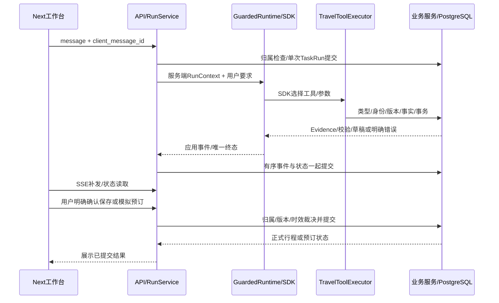

# Travel Agent 集中阅读入口

先按[三段演示](demos.md)运行，再沿下面调用链读代码。当前目标与验收缺口只看[执行计划](../execution/travel-agent.md)；这里解释设计，不是逐模块审批任务。

## 一次用户消息如何完成

入口依次读 [API](../../backend/api/app.py)、[RunService.submit/_execute](../../backend/services/runs.py)、[GuardedRuntime](../../backend/providers/claude_agent/application.py)、[live.run_live](../../backend/providers/claude_agent/live.py)、[worker.run/run_prompts](../../backend/providers/claude_agent/worker.py)、[ClaudeRuntime.options/_collect](../../backend/providers/claude_agent/runtime.py)、[工具定义与执行器](../../backend/tools/travel.py)。

API只处理身份/HTTP；RunService管理业务任务和事件；SDK负责模型/工具往返、回填与原生会话。适配器只做配置、生命周期、消息转换与边界保护。看清这几处，再读具体服务，别从所有文件第一页开始。

## 需要能够解释的取舍

| 问题 | 本项目实际回答与源码入口 |
| --- | --- |
| 为什么选Claude Agent SDK？ | 用户确定路线；复用原生工具循环、MCP、resume与压缩。我们写旅行规则和事务。[ADR003](../adr/003-claude-agent-sdk-runtime.md)说明能力边界；没有第二套LangGraph运行时，也不宣称SDK原生接所有供应商。 |
| Agent state在哪里？ | [TravelRequest](../../backend/domain/travel_request.py)、[Evidence](../../backend/domain/evidence.py)、正式/草稿plan和Booking在PG；TaskRun与有序事件也是PG。SDK transcript在私有目录，只保存可核验的[完整续接指针](../../backend/providers/claude_agent/checkpoints.py)，不是业务真相。 |
| 为什么tool schema这样设计？ | 参数用Pydantic，拒绝未知字段；user/session/run由服务端绑定，模型不能传身份。目录place_id/article_id用于查资料，Evidence UUID用于引用事实，两者不能互换。[单一定义](../../backend/tools/contracts.py)供MCP、CLI、评测复用。 |
| 什么交给模型？ | 理解/追问、选查询工具与参数、拟行程、按校验反馈修改。确认、ID归属、金额/时间、版本、锁、预算、事务与重试裁决交确定性服务。模型文本“用户已同意”不能越过确认API。 |
| 怎么保证价格来源？ | [HotelService](../../backend/services/hotels.py)从目录生成模拟报价/Evidence，带条件revision/来源/版本/有效期。缺税费total未知，服务端不选最低。刷新按当前条件新报价；卡片不能接受模型填入的价格。 |
| 怎么局部改程？ | [PlanPatch](../../backend/domain/plans.py)用稳定item_id与base_version，只作用指定项目；其余内容/酒店保留，锁由用户API修改。[PlanService.stage/confirm](../../backend/services/plans.py)分别暂存与再次校验确认，重复确认返回同正式版本。 |
| 怎么处理模型失败？ | 不自动重跑付费轮次。SDK已知取消/轮数上限/截断均失败，没有成功checkpoint；运行超时回收本次进程树。普通搜索6SDK轮，DB12；实际HTTP、工具次数和业务修复分别限制，不能混成一个数字。 |
| 怎么处理供应商失败？ | [BookingService](../../backend/services/bookings.py)在用户确认后下单。429最多三尝试且总期限5秒；模糊超时/丢响应进入unknown，查询既有client_ref，不能直接再POST。[SupplierClient](../../backend/adapters/supplier.py)做协议隔离，供应商事务保证幂等。 |
| 恢复保证什么？ | 服务启动裁决未完成TaskRun，恢复只读状态/事件，不自动再调用模型或下单。正式写入和operation key在同事务；SDK文件丢失/未完成时从当前业务快照新建，不透明重放旧工具。SSE按已提交序号补发，浏览器断线不生成新任务。 |
| 偏好/Memory为什么这样做？ | [PreferenceService](../../backend/services/preferences.py)仅用户显式改/删；删除保留墓碑版本。每轮注入[当前权威快照](../../backend/providers/claude_agent/database_tools.py)，旧聊天/攻略不能恢复已删偏好或覆盖当前条件。没有向量记忆或模型自动提取写入。 |
| 费用怎么限制？ | 父Guard持有真key，CLI只得到回环令牌。每次实际HTTP先fsync预占，完整usage后结算；未知保持保守占用。CNY/USD不换汇；最新DeepSeek每日≤15 CNY并服从更低配置、无累计金额/次数上限，USD0；每run仍限制HTTP/工具/修复。SDK美元估计不能当DeepSeek账单。[ADR004](../adr/004-sdk-request-budget-boundary.md)。 |
| 怎么eval？ | [eval入口](../../eval/README.md)复用真实服务、每例每轮隔离状态、setup不计分。历史30保留，新冻结20dev/40test，记录代码/schema/数据/hash/模型/原币种和未知字段。规则、脚本、实际模型、语义/人工分开；SDK success不等于旅行任务完成。 |

## 三个已留下证据的失败故事

1. 箱根输入被京都工具替换：基线Trace显示错误查询，需求/提示词补上禁止替换目的地；保留原例实际前后回归。[证据](../evidence/m26-failure-regression-2026-10-03.json)。n=1，不讲总体提升。
2. 供应商创建了订单但响应丢失：客户端unknown，重建BookingService后先查询，得到同一订单；提交前/后实际kill也有对照。验证重点是零/一个订单与稳定client_ref，不是“catch住异常”。[演示2](demos.md#2-丢响应对账与进程恢复)。
3. 三日规划链路无法结束：搜索重复来源导致结果过长，摘要保留完整事实；模型错把Evidence当目录ID后补schema说明；盲增轮数曾无效并回退。随后本机证实终止字段误分类和串行链路6SDK轮不足，修后9HTTP完成草稿。随后原dev实际模型10HTTP生成6项卡片，validation仍partial、住宿未选；[真实记录](../evidence/m36-planning-regression-2026-10-03.json)。原失败保留，单例/脚本不算统计提升。[SDK证据](../evidence/sdk-terminal-planning-2026-10-03.json)、[M3记录](M3.md)。

面试时从一次具体输入，说明模型决策、工具事实、条件版本、数据库状态和用户确认；再拿失败/修复/回归证据回答追问。你需要亲自跑、理解与复述，不能把AI实现和独立审查都写成个人手工完成。

实际限制：京都历史快照、模拟酒店/路线、单worker、本机演示身份；不承诺实时信息、真实付款、企业OAuth、公网生产或完整模型统计。未验收事项见执行计划，不能把这些限制藏在测试数量后面。

语气评审从[eval.judge](../../eval/judge.py)进入同一SDK，零工具/无DB；出站Guard显式温度0，严格评分解析失败为judge_error。一次真实小样本不等于20真人校准；这部分可以与任务事实/约束评分分别理解。

事实/内容评测沿[评测指南](../guides/evaluation.md)读eval/content、eval/judge与eval/persona：SDK评语气或三维内容，事实校验依赖独立必需事实与Evidence字段，真人配对不代填；错误JSON/未知附件/缺标注不是零分或完美分。[M3真实坏例矩阵](M3.md)包含原失败、修复与仍未满足的邻例和历史阈值偏差。

新业务指标从[assess_business](../../eval/state.py)到[business_summary](../../eval/business_metrics.py)：与原checks共享一次PG观测，当前条件重新验证草稿，完整check_counts不受展示截断影响。partial和无冲突不是全条件验证通过；没执行恢复目标就没有恢复率。原付费批次状态未捕获时保持unknown，不能事后用新代码推测原表现。

集中评分准备已从原full第一轮按用例顺序选前20条，含17规则通过/3失败，原回答仅本地`.cache/calibration-preparation/20261004-first20-v1/samples.jsonl`。两个评审入口默认准备均0请求，persona/content真人配对均0/比率null；选择依据与原文件hash见[准备证据](../evidence/calibration-preparation-2026-10-04.json)。它不是全40的质量估计，未代填真人分或外发候选。补分与rubric只读[校准说明](../../eval/calibration/README.md)。

[原运行前4条独立字段审阅](../evidence/content-review-first4-2026-10-04.json)复用原Case/attempt/context/hash及captured Evidence：二条城和攻略来源23项字段陈述与快照一致，其他两条缺事实附件；正文事实、别名子集和地区关系未覆盖。四条完整性都false，整体准确率/覆盖率null，不能把23个匹配当全部事实正确；reviewer为独立Codex agent、无人类分。原文/标注/完整输出仅`.cache/content-review-preparation/20261004-first4-v1/`，公共证据只有hash/计数，0模型调用。

## 2026-10-08 产品修复候选案例

这些是待实施的面试故事方向，不能现在说已解决或编造指标。**2026-10-08 起案例素材统一维护在 [review/cases](cases/2026-10-08-product-v2.md)，下表保留为初稿。**设计见[完整修复规划](../plans/2026-10-08-product-v2.md)，过程证据见[本批次记录](../operations/product-v2.md#2026-10-08-调查与修复准备)。

| 候选案例 | 需要形成的证据与可讨论取舍 |
| --- | --- |
| 旅行隔离/历史恢复（B01/B04/B05/B17） | 新旧session、迟到SSE、多标签/刷新、PG持久历史；为何localStorage只作缓存，复用身份而不是新登录。 |
| 模型文本与业务提交（B02/B03/B12/B14） | 原失败code、草稿/校验/确认/读回、重复确认幂等；为何提示词不能保证数据库或硬约束成功。 |
| 酒店推荐与可信报价（B06/B08–B11） | 不同酒店去重、来源位置/评价、全程与住宿预算、未知价/空房/URL参考；为何不凑数量或按最低价代替偏好匹配。 |
| no-op/版本与失效（B13/B14） | 可见未改与隐藏标准节奏的实际差异、revision语义、正式版本与报价TTL分离；不放松原归属/事务保护。 |
| 可回退发布 | 一个功能一个commit、本地Chrome+CI、兼容契约/迁移、部署失败及恢复；分支隔离不等于production隔离。 |

每个故事按“触发场景→影响→追踪与排除→验证根因→方案与替代方案→回归/边界→commit/部署→限制”整理。批次完成后再补修复前后证据，注明AI协作与个人理解边界。
