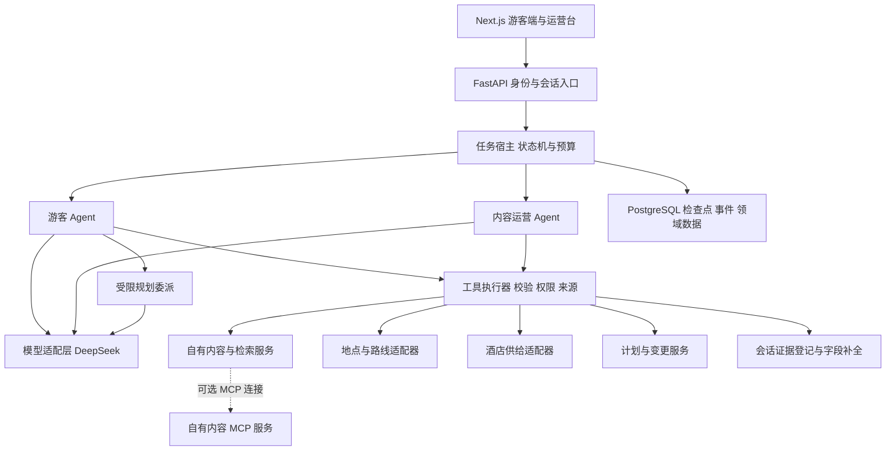

# 02 Agent 架构与实现设计

本文件是拟实现的工程设计。上游能力的出处单独标注；未标注为上游事实的接口、限制与算法都是本项目方案。

## 1. 总体结构



### 职责分配

| 部件 | 负责什么 | 如何限制权限 |
| --- | --- | --- |
| 模型 | 意图理解、选工具、挑选候选、生成解释及计划草案 | 没有数据库凭证、用户身份或直接写接口 |
| 宿主状态机 | 任务阶段、当前请求版本、预算、取消、确认状态 | 只允许定义过的转换 |
| 执行器 | 工具入参、授权、事实来源、配额、错误归类 | 模型不能跳过执行器 |
| 领域服务 | 行程、报价口径、草稿和版本的业务不变量 | 事务、唯一约束、主体验证 |
| 前端 | 已验证卡片、用户编辑与确认 | 组件白名单，不执行模型产生的脚本 |

DataMind 的 Web hearing 是“结构化模型结果 + 代码分支”，Commerce 的 Messages runtime 提供工具循环及展示扩展。这里组合两者：代码控制允许行动的范围，模型在范围内选择如何完成任务。[D03](06-来源与待验证事项.md#d03) [D04](06-来源与待验证事项.md#d04) [C06](06-来源与待验证事项.md#c06)

## 2. 复用 Commerce 的具体边界

优先对 Messages API runtime 做小范围适配，不直接依赖 Claude 托管运行时。Commerce 构造器可传入 client 与 `executor_class`，但 `extra_presentation_tools` 扩展的是展示工具；新增内容查询、地点核验或报价查询，仍须修改工具注册和执行分派。[C06](06-来源与待验证事项.md#c06) [C07](06-来源与待验证事项.md#c07)

| 原有结构 | 拟采用方式 | 必须改造的部分 |
| --- | --- | --- |
| config / events / presentation / delegation 契约 | 固定 commit 的小范围复用或参考 | DeepSeek 不支持的选项、领域状态与载荷 |
| Messages Agent 循环 | 兼容性验证成功后保留总体循环 | Provider adapter、错误协议、预算与持久化 |
| `ShoppingToolExecutor` | 参考其 gate 与 enrich 机制，新建 `TravelToolExecutor` | 注册文章、地点、报价、行程工具 |
| `StorefrontBackend` | 不强行把文章塞进商品购物车接口 | 新建 `TravelBackend` 与 `ContentOpsBackend` |
| 旅行展示扩展 | 保留“模型给 ID、服务端补事实”的原则 | 结构化日期、约束报告和新领域类型 |
| Merchant 暂存变更 | 迁移机制与交互模式 | 变更对象改为自有文章标签、摘要与栏目草稿 |
| 示例认证和内存存储 | 只作示例参考 | 自己实现用户/角色隔离与持久化 |

Commerce 的商品类型有价格字段，文章和地点不应为了满足接口而伪造价格。项目建立独立领域模型。上游 Apache-2.0 许可和版权文件应保留；DataMind 根目录未发现 LICENSE，实际复制其代码前需确认许可。[C08](06-来源与待验证事项.md#c08) [C09](06-来源与待验证事项.md#c09) [D08](06-来源与待验证事项.md#d08)

P0 产出 `upstream-map.md`：逐项记录复用文件、来源 commit、改动和保留通知。P0 之后锁定实际复用范围，避免一开始把整个上游搬来再大改。

## 3. DeepSeek 模型适配

官方当前提供 Anthropic 格式接口。拟先通过配置 DeepSeek base URL 的异步 client 验证 Commerce 路径，所有角色显式使用 DeepSeek 模型名。当前文档示例为 `deepseek-flash`；具体名称和价格在实现时重新核实并锁定。[W03](06-来源与待验证事项.md#w03)

DeepSeek 的兼容表说明 `mcp_servers` 与 `cache_control` 被忽略，原生 MCP 结果类型不支持，`disable_parallel_tool_use` 也被忽略。故 MCP、并发上限和来源展示由应用实现；不依赖模型端开关提供约束。被忽略的 cache 指令不表示 DeepSeek 完全没有缓存能力。[W03](06-来源与待验证事项.md#w03)

### P0 必须测试的协议链路

- 普通消息、system、流式 text、结束原因、usage 是否能被当前 SDK 正确解析。
- 一个和多个工具调用：名称、tool-call ID、参数、tool result、后续模型回应能闭环。
- 分段参数解析、无效 JSON、未知工具、工具错误与空结果；不用未经验证的 eager dispatch。
- 强制工具选择、禁止工具、结构化输出的实际行为；字段不支持时应用层降级。
- 取消、连接中断、限流、超时；SDK 重试与应用重试不可叠加成无界重试。
- 主循环、记忆提取、委派都从统一 ProviderConfig 读配置，不能残留默认 Claude 模型调用。

成功才选择直接兼容路线。失败则实现 provider-independent 消息层：把 DeepSeek Chat Completions 的 stream/tool calls 归一为内部事件，保留领域工具执行器。二者最终只保留一个生产路径，避免长期维护两套 Agent 行为。

拟定义接口如下，它是应用内部契约，不是任何供应商真实 API 签名：

```python
class ModelProvider(Protocol):
    def stream(self, request: ModelRequest) -> AsyncIterator[ModelEvent]: ...

# ModelEvent: text_delta | tool_call_ready | usage | finished | error
# capability flags 由 P0 验证结果填写，不由模型自行声明。
```

配置至少区分 `main_model`、`delegate_model`、`memory_model`、输出 token 上限、timeout、并发与总预算。初期用同一 DeepSeek 模型方便公平对比；复杂模型是否值得用由评测决定。

## 4. 状态机与 Agent loop

### 三层状态

1. `ConversationState`：对话消息、压缩摘要、来源登记、角色、当前 turn/revision。
2. `TravelRequest`：当前旅行的日期、城市、同行人、预算、交通方式、兴趣、已订酒店、硬/软条件。
3. `TaskRun`：当前长任务的阶段、步骤、消耗、取消标记、检查点、事件序列和输出版本。

长期偏好存储不等同于上述状态。旅行中的“这次要便宜”不会自动写成永久偏好；文章默认地点不会覆盖用户的新目的地。

### 拟定阶段

`collecting → researching → drafting → validating → presenting → completed`。

必要时进入 `awaiting_user`、`awaiting_approval`、`recoverable_failure` 或 `cancelled`。状态是持久化数据，模型只提出动作。判断“信息是否够用”按工具所需条件：文章浏览可先推荐，查酒店必须有准确日期和人数；不强制收齐所有字段才给任何帮助。

DataMind 存在六个听取维度，并区分 user/default；其代码也允许在模型判断条件足够或轮数达到上限时推荐，不能描述成固定六问表单。[D04](06-来源与待验证事项.md#d04) [D09](06-来源与待验证事项.md#d09)

### 一轮执行顺序

1. 宿主绑定 principal、会话和 request revision，加载状态与有效证据。
2. 把新输入作为结构化 patch 提取；代码保留未被修改的值，冲突时优先本轮明确输入。
3. 根据阶段、角色、已知条件与预算筛选工具；需要事实的推荐任务必须先走有效读取路径。
4. 构造最小模型上下文，调用模型。
5. 模型请求工具时，执行器依次做 schema → precondition → role/ownership → source scope → budget 检查。
6. 仅相互独立的读取可并发；写入、依赖性查询、确认和版本变更串行处理。
7. 结果归一化后登记 evidence，发送业务进度与结果摘要，回传模型。
8. 模型提出计划或展示 payload 时，再跑领域校验和服务端补全；失败只允许有限次修正。
9. 保存状态及事件；输出校验过的卡片与说明。达到轮次/预算上限时返回部分成果和缺口。

工具返回空结果与不可用是不同状态；不能把供应商超时解释为“该地区没有酒店”。模型连续重复同一调用时触发去重/loop guard。

## 5. 工具执行器与事实控制

### 统一工具契约

每个工具声明：`name`、入参 schema、结果 schema、所需状态、角色、read/draft/apply 级别、timeout、幂等策略、结果上限、来源类型与成本类别。模型看到业务参数，宿主注入身份、密钥和 trace context。

统一结果包：

```json
{
  "status": "ok",
  "data": {},
  "evidence_ids": ["ev_example"],
  "mode": "fixture",
  "warnings": [],
  "error": null
}
```

工具失败用 `validation / blocked / unavailable / rate_limited / timeout / provider_error / conflict / cancelled` 分类。即使供应商的 `is_error` 兼容性不足，模型也能从普通结果包读到明确状态。

### Evidence registry

每条可引用事实记录对象 ID、字段、原始来源、取得时间、适用日期/人数、权利策略、请求作用域和有效期。前端的事实字段通过这个 registry hydrate：模型可选择 `offer_id`、`place_id`、`article_id`，不能任意填价格、地址、退款期限或跳转 URL。

严格区分：

- 资料事实：必须有可解析 evidence；缺失即 null/未知。
- 用户事实：来自当前用户输入，并记录发生轮次。
- 推导结论：记录输入 evidence 与计算逻辑，如相同口径的价差。
- 建议判断：可以是模型观点，但不能包装成客观已验证事实。

不是把任意引用文字放进答案就算有来源。证据必须属于当前会话/任务，未过期且支持所用字段。错误对象 ID、跨用户证据、日期不符的报价全部阻断。

自由文本里的事实也要审查：优先把金额、日期、名称做结构化槽位；句子级断言用证据对齐与评测辅助。不能仅凭 ID gating 宣称绝对杜绝幻觉。

Commerce 的来源与展示补全机制可参考，但数据包裹本身不能保证消除提示注入。[C03](06-来源与待验证事项.md#c03) [C05](06-来源与待验证事项.md#c05)

## 6. RAG 与内容推荐

内容库只摄取自有/明确获授权文本。每篇包含 ID、原文链接、城市/区域、标签、适用人群、发布时间、核验时间、权利声明和原始内容版本。切分保持段落、章节与事实出处，中文检索保留日英原名和别名。

第一版做关键词/全文 + 城市/人群过滤。第二版试验向量召回和融合排序；embedding 提供方与模型在 P0 对比后锁定，可选择本地可运行且许可明确的多语言模型。不能假设聊天 API 自动提供 embeddings。

召回分三步：明确硬条件过滤 → 宽召回 → 结合兴趣、同行人和内容新鲜度重排。只有内容可用且来源允许时才进行检索摘要。用户明确的城市与日期不可静默放宽；软偏好放宽时记录 relaxation trace，并告诉用户。

DataMind 有逐步减少查询维度、保留地区过滤的实现。本项目借鉴该模式，但自行定义硬条件，不照搬其特定地区枚举与私有内容服务。[D05](06-来源与待验证事项.md#d05)

自有内容为第一来源。外部搜索只有在明确启用且有合法数据渠道时补充；按来源展示，不能拿网页攻略确认酒店实时价格。P1 不依赖通用网络搜索，也不默认抓取 Rurubu 全站。

## 7. 记忆与上下文管理

| 记忆层 | 存什么 | 更新规则 |
| --- | --- | --- |
| 当前轮上下文 | 新请求、有效工具结果、当前候选 | 每轮按预算整理 |
| 当前旅行状态 | 日期、同行人、硬/软条件、选择与排除原因 | 用户明确修改，版本递增 |
| 会话摘要 | 完成的步骤、待办、证据 ID、冲突 | 保留结构化状态；不以摘要取代状态 |
| 长期偏好 | 用户允许记住的稳定偏好 | 可查看、修改、删除；附来源与时间 |
| 已保存行程 | 自己的计划版本与用户选择 | 版本化保存；时效事实按策略重新取得 |

记忆提取只针对合适的用户陈述；工具返回文本不能直接成为长期“用户偏好”。抽取写入前检查 generation/version，避免用户清空记忆后旧异步任务又写回来。不同用户的存储与 retrieval 必须隔离。

Commerce 有 MemoryStore 契约和写入过滤机制；这里要补上持久化、可见管理和业务冲突规则。[C10](06-来源与待验证事项.md#c10)

压缩以 token 预算触发，保留近期必要交互及结构化 request。证据事实不通过自由文本摘要重新创造；摘要只保留引用 ID，实际使用前重新解析来源登记。

## 8. 规划算法与受限委派

### 单 Agent 基线先跑通

模型从验证过的候选中选择地点与酒店，提出结构化安排。确定性 validator 检查日期、间隔、路段、开放时间、预算和重复项，再反馈有限次修正。短途 POC 不承诺全局最优解。

时间计算使用时区明确的日期/时间；停留时长是计划估计，与外部路线时间分开标注。已知关闭或时间重叠算冲突；未知开放时间显示 `unknown`，不把“未发现冲突”描述成完全可行。

预算区分酒店实际报价、活动已知费用、交通估计和未知支出。第一版统一 JPY；没有实际汇率和时间戳时不把其他币种相加。硬上限无法满足时给出缺口和可选修改，不能偷偷放宽。

### 规划委派的边界

主 Agent 判断任务复杂时调用 `plan_itinerary`。委派收到固定 request snapshot、允许使用的候选和证据、结构化 output schema、时间/token 上限。它可以提出两种排序/安排方案，不能发布内容、保存计划、调用其他委派或自行获得更大的工具集合。

父 Agent 对返回结果重新验证；委派失效/超时时退回单 Agent。委派的用量计入总预算。是否默认启用由相同数据、模型、预算下的消融实验决定。

Commerce 的 DelegateExtension 展现了独立任务输入与结构化结果的契约；实际隔离仍需要本项目的工具白名单和权限检查，不可把契约文字当成天然的安全沙箱。[C11](06-来源与待验证事项.md#c11)

P2 暂不运行无限制“研究员/规划师/评论员”群聊。每个额外角色都要有输入、输出、权限、预算和实验收益。

## 9. 内容运营 Agent 与人工确认

运营 Agent 读取自有内容、匿名化检索事件和覆盖汇总。可生成标签建议、摘要修改与专题草稿，不拥有外部 OTA 价格写入能力。

变更协议：`read source → stage change → show diff → host approval → apply`。

草稿保存 source IDs、原版本、建议字段、理由、发起者、有效期。前端确认请求绑定真实运营身份与草稿版本；后端重新检查权利、字段白名单、版本和证据。确认过期或内容被别人修改时返回 conflict，要求重新预览。

聊天里的“我同意”不能直接获得特权。应用写入使用数据库事务和幂等键；同一个确认重试只返回同一变更结果。审计记录包含前后值与确认主体。

分析先用确定的汇总工具；确有必要再开放 SQL 查询工具，限定自有分析 view、只读数据库角色、SQL AST 验证、行数与时间上限。不能用正则禁止 UPDATE 就宣称只读安全；不开放任意 Python/SQL 执行。

Commerce Merchant 有暂存/应用机制及分析委派示例。其供应商定价例子被迁移成内容运营对象，语义需要重新实现。[C12](06-来源与待验证事项.md#c12) [C13](06-来源与待验证事项.md#c13)

## 10. 持久化任务、恢复与取消

建议表：`sessions`、`travel_requests`、`task_runs`、`task_steps`、`events`、`evidence_refs`、`plan_versions`、`content_change_drafts`、`audit_events`、`preferences`。

任务宿主在每个完成的步骤写 checkpoint：输入版本、完成状态、输出引用、预算余额和最后 event seq。恢复时重新验证来源有效期与当前请求版本，过期读取重新获取；已完成的本地写入根据幂等键取结果，不再次执行。

SSE 重连只重放事件，不意味着重新调用模型和工具。前端带 last-event ID；任务没有结束时继续订阅。事件可单独持久化，禁止保存供应商不允许长期存储的原始内容。

新输入使 request revision 递增，取消旧运行；所有晚到工具/模型结果先检查 revision。旧任务不再修改当前状态，也不能把旧卡片覆盖到新请求页面。异步工具若无法真正中止，丢弃迟到结果并记录已消耗成本。

错误处理策略：读取的瞬时网络错误可有限退避重试；validation、blocked、conflict 不盲目重试。写入先判断幂等结果和数据库状态；外部操作不默认存在端到端 exactly-once 保证。

初期用 PostgreSQL 与一个后台 worker 管理持久化任务。只有吞吐/调度需求证明必要时再增加独立队列；不能为了简历引入没有被使用的基础设施。

## 11. 结构化流式输出

内部事件至少包含：`event_id`、`run_id`、`turn_id`、`revision`、`type`、`timestamp`、`payload_version`、`payload`。

| 事件 | 用户能看到的内容 | 数据控制 |
| --- | --- | --- |
| `task_started / progress` | 当前在做什么 | 宿主从阶段生成 |
| `text_delta` | 解释文本 | 不提前展示未经核验的报价事实 |
| `card_ready` | 文章、地点、报价、比较表 | schema 校验后服务端补全 |
| `plan_validated` | 行程、冲突与未知项 | validator 结果不可由模型覆盖 |
| `draft_ready` | 运营变更差异 | 绑定草稿和原始版本 |
| `budget_warning / degraded` | 部分完成与缺口 | 宿主真实状态 |
| `completed / cancelled / error` | 最终状态与后续可做事项 | 不混淆取消和完成 |

部分 tool input streaming 只能用于开发调试，不直接作为可信业务卡片。渲染组件白名单，链接由来源适配器生成并检查允许域名、协议与参数；不接受模型生成 iframe、脚本或任意 HTML。

## 12. 可观测性、预算与输入攻击

Trace 记录模型/工具次数、耗时、用量、错误类别、来源 ID、请求版本、角色和子任务关联。不记录密钥、完整身份、未授权文章或供应商敏感响应。成本按有日期的价格配置计算，估算与供应商账单分开。

预算分为单轮、整任务、会话/用户和全局外部 API 配额；委派共享总预算。读取详情按需要挑候选而非每条都查；同样查询的合法短期复用遵循各来源权利策略。预算耗尽返回已验证部分结果，禁止无限纠错。

文章、评论、酒店描述和 MCP 工具结果视为不可信数据。它们不能修改 system 指令、身份、工具集合或批准状态。对“忽略之前规则”“调用发布工具”“把另一个用户计划拿来”等载荷写专门回归用例；格式包裹是辅助措施，权限和执行检查才是约束。

## 13. 拟建代码目录

```text
Plaid_Agent/
  plan/                       本次计划
  apps/web/                   Next.js 游客端、运营端、调试路由
  backend/
    api/                      HTTP、身份、SSE、确认入口
    agent/                    loop、状态机、prompt、策略与预算
    providers/                DeepSeek 与内部消息协议
    tools/                    注册、执行、schema、错误
    domain/                   request、offer、evidence、plan、change
    services/                 检索、计划校验、记忆、变更与任务宿主
    adapters/                 fixture、Google、Booking、Agoda
    mcp/                      自有内容服务与受限客户端
    persistence/              表、repository、事务与版本
  upstream/                   最小复用代码、许可、改动记录
  data/fixtures/              自制测试数据和权利说明
  eval/                       数据集、评分、基线、故障与报告
  tests/                      领域、协议、契约与关键交互
  docs/adr/                   关键选择及验证结果
```

上述目录尚未创建。核心 ADR：运行时复用方式、领域类型、来源保存政策、状态与记忆、委派收益、写入确认及恢复语义。ADR 必须记录证据和替代方案，不能只记录使用了什么技术。
